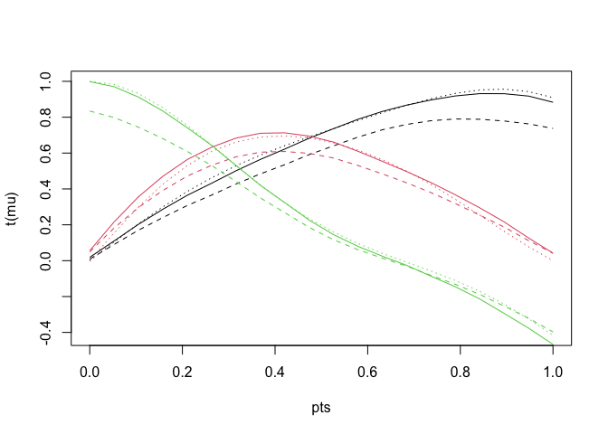

Riemannian Functional Principal Component Analysis
================

This is the R package `RFPCA` implementing the sparse and dense
Riemannian functional principal component analysis methods. C.f.

  - Dai, X., & Müller, H. G. (2018). Principal component analysis for
    functional data on riemannian manifolds and spheres. The Annals of
    Statistics, 46(6B), 3334-3361.
  - Dai, X., Lin, Z., & Müller, H. G. (2019). Modeling Longitudinal Data
    on Riemannian Manifolds. [ArXiv](https://arxiv.org/abs/1812.04774)

## Installation

To install `RFPCA` from GitHub

``` r
devtools::install_github('CrossD/RFPCA')
```

## Example on a sphere

First simulate some sparse Riemannian functional data on S^2, the
2-dimensional unit sphere in R^3.

``` r
library(RFPCA)

set.seed(1)
n <- 50
m <- 20 # Number of different time points

K <- 20
lambda <- 0.07 ^ (seq_len(K) / 2)
D <- 3
basisType <- 'legendre01'
sparsity <- 5:15
sigma2 <- 0.01
VList <- list(
  function(x) x * 2, 
  function(x) sin(x * 1 * pi) * pi / 2 * 0.6,
  function(x) rep(0, length(x))
)
pts <- seq(0, 1, length.out=m)
mfdSp <- structure(1, class='Sphere')
mu <- Makemu(mfdSp, VList, p0=c(rep(0, D - 1), 1), pts)

# Generate noisy samples
samp <- MakeMfdProcess(mfdSp, n, mu, pts, K = K, lambda=lambda, 
                       basisType=basisType, sigma2=sigma2)
spSamp <- SparsifyM(samp$X, samp$T, sparsity)
yList <- spSamp$Ly
tList <- spSamp$Lt
```

Fit RFPCA model

``` r
bw <- 0.2
kern <- 'epan'

resSp <- RFPCA(yList, tList, 
               list(userBwMu=bw, userBwCov=bw * 2, 
                    kernel=kern, maxK=K, 
                    mfd=mfdSp, error=TRUE))
resEu <- RFPCA(yList, tList, 
               list(userBwMu=bw, userBwCov=bw * 2, 
                    kernel=kern, maxK=K, 
                    mfd=structure(1, class='Euclidean'), 
                    error=TRUE))
```

Plot the mean function

``` r
# Dotted curve stands for the true mean, 
# dashed for the estimated mean function using the euclidean method, 
# and solid for our intrinsic Riemannian method.
matplot(pts, t(mu), type='l', lty=3)
matplot(pts, t(resEu$muObs), type='l', lty=2, add=TRUE)
matplot(pts, t(resSp$muObs), type='l', lty=1, add=TRUE)
```

<!-- -->

Plot the principal components; up to 3 were well-estimated

``` r
plot(resSp$xi[, 3], samp$xi[, 3], xlab='estimated xi_3', ylab='true xi_3') 
```

<!-- -->
